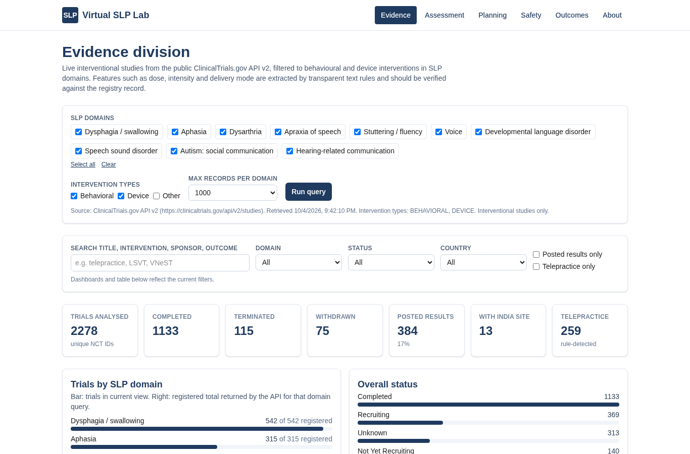

# SLP Compass

**An open web platform for evidence-guided speech-language pathology practice.**

A human-guided, multi-division web tool for speech-language pathologists (SLPs) and researchers.
Inspired by the Virtual Biotech framework (Zhang et al., *Science*, 2026), in which AI agents are organised
like the divisions of an organisation and a human expert stays in charge.

> Educational and research use only. Not a medical device. Not a substitute for clinical judgment.

**Live app:** https://slpcompass.vercel.app

[](https://vercel.com/new/clone?repository-url=https://github.com/Hemaraja9994/slp-compass)

*Formerly "Virtual SLP Lab". Old links (https://virtual-slp-lab.vercel.app and github.com/Hemaraja9994/virtual-slp-lab) continue to work.*



## Purpose

SLP intervention research is spread across many registries and reports, and dose, intensity and delivery
details are rarely summarised. SLP Compass gives clinicians and students a single, free place to:

- explore registered behavioural and device trials in SLP domains, live from ClinicalTrials.gov;
- compute common descriptive speech and language metrics without sending data anywhere;
- draft ICF-based SMART goals;
- review general red flags for dysphagia and communication referral;
- track session-by-session outcomes with participant codes only.

## Divisions (features)

| Division | What it does |
| --- | --- |
| **Evidence** | Queries the public [ClinicalTrials.gov API v2](https://clinicaltrials.gov/data-api/api) through a Next.js server route for 10 SLP domains (dysphagia, aphasia, dysarthria, apraxia of speech, stuttering/fluency, voice, developmental language disorder, speech sound disorder, autism social communication, hearing-related communication), interventional studies with Behavioral and/or Device (optionally Other) interventions. Rule-based extraction of sessions, minutes per session, sessions per week, duration, estimated total hours, intensity label, delivery mode (telepractice, app/digital, group, home/caregiver, in-person), population tags, phase, status with `whyStopped` grouping, posted results and enrollment. Dashboards: counts by domain (with the API's registered totals), status, countries (India highlighted), completed vs stopped by domain, termination reasons, posted results, delivery, intensity, population, phase. Filterable table linking to every record, CSV export, and an optional bring-your-own-key AI annotation agent with a clinician verification checkbox. |
| **Assessment** | Browser-only calculators: %SS, SLD and other disfluencies per 100 syllables, a live tap counter (F/S keys), speaking rate (SPM, WPM), articulation rate, MLU in words, approximate MLU in morphemes (English), NDW and TTR from pasted utterances. Links to the companion [fluency-annotator](https://github.com/Hemaraja9994/fluency-annotator) project (private). No copyrighted test content is included. |
| **Planning** | ICF goal builder (Body Functions and Structures, Activity, Participation, plus Environmental and Personal factors) that generates SMART goal text from clinician inputs, with optional ICF code suggestions and a printable summary. |
| **Safety** | Educational red-flag checklists: urgent signs, possible aspiration, when instrumental assessment (VFSS/FEES) may be warranted, medical referral, voice, child and adult communication. Links only to verified sources (IDDSI, ASHA Practice Portal, AAO-HNS hoarseness guideline, JCIH 2019). |
| **Outcomes** | Session-by-session tracker stored only in browser localStorage, participant codes only (validated, no spaces), SVG line chart, CSV export, JSON backup and restore. |

### Human in the loop

- Rule-based features show the text they matched so they can be checked.
- AI annotations are saved as **unverified** until a clinician ticks "Clinician verifies"; editing a field resets verification.
- The AI agent only receives public registry text and is instructed to answer "not reported" rather than guess.

### Optional AI annotation agent

- Works with any OpenAI-compatible `/chat/completions` endpoint (base URL and model are configurable).
- The API key is stored only in the browser's localStorage and sent only with each annotation request.
- **Relay mode** (default): the key is sent in a request header to `/api/annotate`, which fetches the trial from
  ClinicalTrials.gov, calls the endpoint once and returns a structured annotation. The key is never logged or stored.
  The relay only accepts public `https` base URLs.
- **Direct mode**: the browser calls the provider itself (the provider must allow CORS).
- Schema: target population, intervention type, dose, outcome measure, primary outcome direction (uses posted
  results when available), supporting quote, model confidence, clinician verified, clinician note.
- Without a key, everything else works.

## Run locally

Requirements: Node.js 20.9 or later.

```bash
git clone https://github.com/Hemaraja9994/slp-compass.git
cd slp-compass
npm install
npm run dev        # http://localhost:3000
npm run lint
npm run build && npm start
```

Quick API check:

```bash
curl "http://localhost:3000/api/trials?domains=aphasia,dysarthria&types=BEHAVIORAL,DEVICE&max=1000"
```

### API routes

| Route | Purpose |
| --- | --- |
| `GET /api/trials?domains=aphasia,voice&types=BEHAVIORAL,DEVICE&max=1000` | Live ClinicalTrials.gov query, de-duplicated across domains, with rule-based features. Cached for 1 hour per server instance and via CDN headers. |
| `GET /api/trial-context?nct=NCT01234567` | Text-only context for one trial (used by direct-mode annotation). |
| `POST /api/annotate` | AI annotation relay. Body `{ nctId, baseUrl, model }`, header `x-llm-api-key`. |

No environment variables are required.

## Deploy to Vercel

Zero configuration: Vercel detects Next.js automatically.

1. Push this repo to GitHub.
2. In Vercel, choose **Add New... > Project**, import `Hemaraja9994/slp-compass`, keep the defaults, and deploy.
3. Or use the one-click deploy button:

[](https://vercel.com/new/clone?repository-url=https://github.com/Hemaraja9994/slp-compass)

The `/api/trials` and `/api/annotate` routes set `maxDuration = 60` seconds, within the Hobby plan limits.

## Cloudflare notes

The Evidence and annotation features need server routes, so a pure static export is not enough.

- **Recommended (Cloudflare Workers):** Cloudflare currently recommends [vinext](https://developers.cloudflare.com/workers/framework-guides/web-apps/nextjs/)
  (beta) for Next.js 16 apps: run `npx vinext check`, then `npx vinext init` (choose Cloudflare Workers),
  `npm run build:vinext`, and `npx @vinext/cloudflare deploy`.
- **Alternative:** the [OpenNext Cloudflare adapter](https://opennext.js.org/cloudflare).
- **Cloudflare Pages (static only):** possible only as a static export (`output: "export"`), which would
  disable the Evidence API routes. The Assessment, Planning, Safety and Outcomes divisions would still work.
- The server code uses only standard `fetch`, so it should run on Workers without changes; test before relying on it.

## Privacy

- No accounts, database, cookies for tracking, or analytics.
- No patient or client data is sent to or stored on the server.
- Assessment and planning inputs are processed in the browser only; outcome data lives in browser localStorage on the user's device.
- The server only relays requests for public data to ClinicalTrials.gov (and, if the user opts in, to their chosen AI endpoint for public registry text).
- Use participant codes, never names, and follow institutional data protection rules.

## Disclaimer

SLP Compass is for educational and research use only. It is not a medical device, does not diagnose or
recommend treatment, and does not replace clinical judgment, local protocols or medical advice. Registry data can
be incomplete or outdated, and rule-based or AI extraction can be wrong: always check the source record.

## Limitations (v1)

- Domain queries are keyword-based (ClinicalTrials.gov condition search) and can include some non-SLP trials
  (for example aspiration in ventilated infants under dysphagia) or miss trials described with other terms.
- Dose and delivery extraction uses regular expressions over registry text and returns the first match; it can
  miss or misread values. Matched text is shown for checking.
- Only ClinicalTrials.gov is searched; Indian trials registered only with CTRI are not included yet.
- MLU in morphemes is a simplified English approximation.

## Roadmap

- Multi-agent annotation at scale: batch AI annotation across all fetched trials with agreement checks between agents and clinician adjudication.
- CTRI (Clinical Trials Registry of India) integration alongside ClinicalTrials.gov.
- Assessment: speech recognition (ASR) assisted syllable counting and basic acoustics (for example fundamental frequency, intensity, voice quality measures) in the browser.
- Kannada language support for the interface and language-sample tools.
- Shared, de-identified evidence annotations for the SLP community.

## Related tools

- **Audiology Compass**, the sister tool for audiology practice: https://audiologycompass.vercel.app (code: https://github.com/Hemaraja9994/audiology-compass)

## Citation and credit

Inspiration: Zhang HG, Eckmann P, Miao J, Mahon AB, Zou J. The Virtual Biotech: A multi-agent AI framework for
therapeutic discovery and development. *Science*. 2026;eaeg6779. https://doi.org/10.1126/science.aeg6779

Author: **Hemaraja Nayaka S**, Associate Professor, Department of Audiology and Speech-Language Pathology,
Yenepoya Medical College, Yenepoya (Deemed to be University), Mangaluru, India.

This project is independent and not affiliated with the authors of the inspiration paper.

## License

[MIT](LICENSE)
